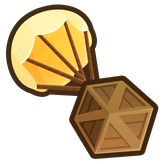

<h1 align="center">CashButton</h1>

Adds two towers that give you and sets your cash there's also two towers that give 10x and 100x the amount of this one. The amount the buttons give/set to can be difined in the config.

